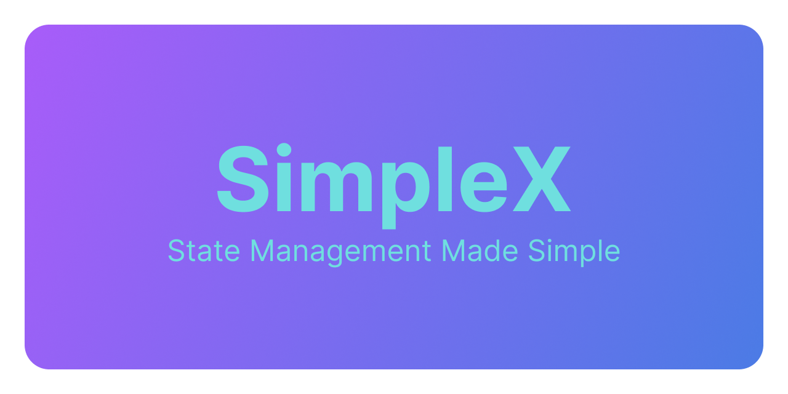

<!--
This README describes the package. If you publish this package to pub.dev,
this README's contents appear on the landing page for your package.

For information about how to write a good package README, see the guide for
[writing package pages](https://dart.dev/guides/libraries/writing-package-pages).

For general information about developing packages, see the Dart guide for
[creating packages](https://dart.dev/guides/libraries/create-library-packages)
and the Flutter guide for
[developing packages and plugins](https://flutter.dev/developing-packages).
-->



> Note that Simple X at its current state now is not stable, use it at your 
> own risk.

Simple X is a simple state management library for Flutter. It is heavily 
inspired by [GetX](https://pub.dev/packages/get) in a sense
that
1. their APIs are quite similar; and 
2. they both allow the use of mutable variables for state management. 

Prior to using this GetX, my team and I have searched through countless 
other state management libraries. We started from 
[BLoC](https://pub.dev/packages/flutter_bloc), moved to 
[MobX](https://pub.dev/packages/mobx), then moved to 
[Riverpod](https://pub.dev/packages/riverpod). The benefit of using these 
libraries is that they all make the state very "reactive" and "observable," 
however, one significant downside is that they all have much boilerplate 
code and that they require the use of immutable states (not with MobX, but 
it requires the use of code generation).

I created this library 
because I ran into a bug with GetX's builder, because that widget contains 
some global getter, and I only wanted to create some local states. 
Also, GetX's documentation, despite being long, is not as 
clear as what I would like. Hence, there comes this library.

More specifically, I wish to accomplish the following two goals:

1. Provide a separation between the UI and the business logic;
2. Make some common operations easier by reducing as much boilerplate code 
   as possible.

## Features

The core of this library consists of two classes: `SimpleController` and 
`SimpleView`. The former is a base class, the extension of which shall be 
used to contain the business logic. The latter is a widget that can be 
extended to work with a `SimpleController`. 

### SimpleController 

A `SimpleController` is a controller that is, well, simple. You cannot 
instantiate it directly, so to use it, you will have to create a 
subclass. We will use the Flutter's counter app as an example. 

```dart
class CounterController extends SimpleController {
  int counter = 0;
  
  void increment() {
    counter++;
    refresh();
  }
}
```

You can do whatever with the counter variable, and when you want to ask the 
UI to rebuild, you just call `refresh()`.

Now, there are more things that you can do with a `SimpleController`. For 
example, if, instead of setting the counter to 0 in the beginning, you want 
it to be read from the database, which would require an asynchronous 
operation, you can do the following: 

```dart
class CounterController extends SimpleController {
  int counter = 0;
  
  @override 
  Future<void> onFirstReady() async {
    counter = await getCounterFromDatabase();
  }
}
```

and you are done.

Below is a list of the methods that are available to be overridden in a 
`SimpleController`:

- `onBound()`: Called whenever the controller is bound to a widget. It will 
  fire for all the widgets that are bound to the controller. 
- `onInit()`: Called after controller is bound to the first widget, and 
  returns the `void` type. You can do some initialization here, but calling 
  the `refresh()` will have no immediate effects. If you wish to rebuild the 
  widgets after initialization, you can call `refresh()` in the
  `Future.then` callback:
  ```dart 
  @override 
  void onInit() {
    final counterFuture = getCounterFromDatabase();
    counterFuture.then((value) {
      counter = value;
      refresh();
    });
  }
  ```
- `onFirstReady()`: Called when the first widget is ready. This method will 
  only be called once. This function can be asynchronous, and it returns a 
  `FutureOr<void>`.
- `onReady()`: Called each time when a widget that's bound to this 
  controller is ready. This function can be asynchronous as well. 
- `onUnbind()`: Called when the controller is unbound from a widget. It will 
  fire for all the widgets that are bound to the controller.
- `onDispose()`: Called when the controller is disposed. This method will 
  only be called once. By default, this method would be called after all the 
  bindings to the widgets are removed. You can, however, disable this by 
  overriding the `keepAlive` property to `true`.

### SimpleView 

A SimpleView is a widget that can be used to bind a `SimpleController` to 
rebuild after the `controller.refresh()` is called. To use it, you have to 
extend it:

```dart
class CounterView extends SimpleView<CounterController> {
  const CounterView({
    Key? key,
    required super.controller,
    super.groupKey,
  });
  
  @override
  Widget build(BuildContext context) {
    return Scaffold(
      appBar: AppBar(
        title: Text('Counter'),
      ),
      body: Center(
        child: Text(
          'You have pushed the button this many times:',
        ),
      ),
      floatingActionButton: FloatingActionButton(
        onPressed: controller.increment,
        tooltip: 'Increment',
        child: Icon(Icons.add),
      ),
    );
  }
}
```

Alternatively, if extending a widget it too much hassle, I have also 
provided two other concrete extensions of `SimpleView`: `SimpleComponent` 
and `SimpleBuilder`. The difference between them is that `SimpleComponent` 
asks you to pass in a `child` while `SimpleBuilder` asks you to pass in a 
builder function. 

```dart
@override
Widget build(BuildContext context) {
  return SimpleComponent(
    controller: controller,
    // it is your responsibility to use the same instance of controller here
    // inside the builder function
    child: ...
  );
}
```

or 

```dart
@override 
Widget build(BuildContext context) {
  return SimpleBuilder(
    controller: controller,
    builder: (context, controller) {
      return ...
    },
  );
}
```


## Getting started

To use this library, add `simple_sx` as a dependency in your pubspec.yaml, 
then it should be good to go.

## Usage

Has been covered in the Features section.

## Additional information

TODOS:
- [ ] Write tests to test all the features;
- [ ] Create some helper functions like `useTextEditingController` etc. to 
  help with composing and disposing of the controllers;
- [ ] Add support for animations;
- [ ] Set up CI/CD.
